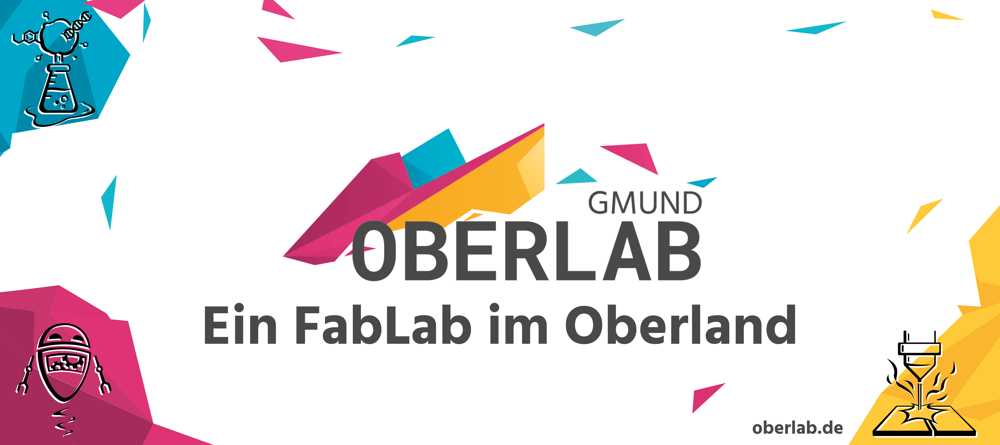

Das <b>OberLab Gmund</b> ist eine <b>frei zugängliche Forschungswerkstatt</b>, die <b>High-Tech-Geräte</b> und das dazugehörige <b>Know-How</b> bereitstellt. Wir sind ein Makerspace, der Jung und Alt fürs <b>Selbermachen</b>, <b>Lernen</b> und <b>Forschen</b> begeistert. Bei uns ist Platz für <b>Austausch</b>, <b>Design</b>, <b>Prototyping</b> und <b>Experimente</b>. Kurz: Wir sind ein offener Raum, in dem <b>Tüftler</b> und <b>Technikbegeisterte</b> zusammenkommen.

---

:globe_with_meridians: **Website**: [oberlab.de](https://www.oberlab.de)

:camera: **Instagram**: [@FabLabOberland](https://www.instagram.com/FabLabOberland)

:tv: **YouTube**: [@fablaboberland](https://www.youtube.com/@fablaboberland)

---
